### What This Demo Is About (and Why It Matters)

In this write-up, I wanted to move beyond simply _seeing logs in Splunk_ and instead use those logs to detect suspicious behavior and generate alerts, specifically around failed SSH login attempts.

This is a very common real-world use case. Repeated authentication failures over SSH are often an early signal of brute-force attacks, credential stuffing, or automated scanning. Being able to identify these patterns quickly and reduce alert noise is a core skill in SOC and incident response roles.

The goal here was to:

- Validate that Splunk can detect failed SSH logins in near real time
    
- Build a search that identifies suspicious patterns
    
- Turn that search into an alert
    
- Test the alert using realistic attack behavior
    
- Troubleshoot and fix issues when detection doesn’t work as expected
    

---

## Establishing a Baseline: Failed SSH Logins

I started by checking Splunk for failed SSH login attempts using the following search:

`index=linux_logs "Failed password"`

At this point, I could already see a few failed login attempts from the previous day. These were expected  because I had intentionally entered the wrong password three times while logging in as my user (`austin`) during testing.

To confirm ingestion and timing, I attempted another SSH login and deliberately entered the wrong password twice before logging in correctly. I then checked Splunk again and confirmed that the new failed logins appeared almost immediately.

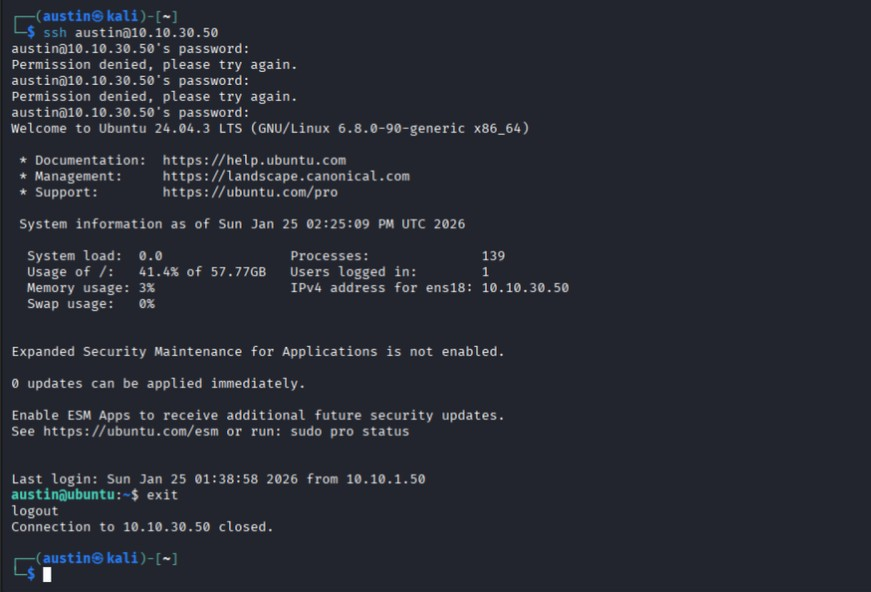
    
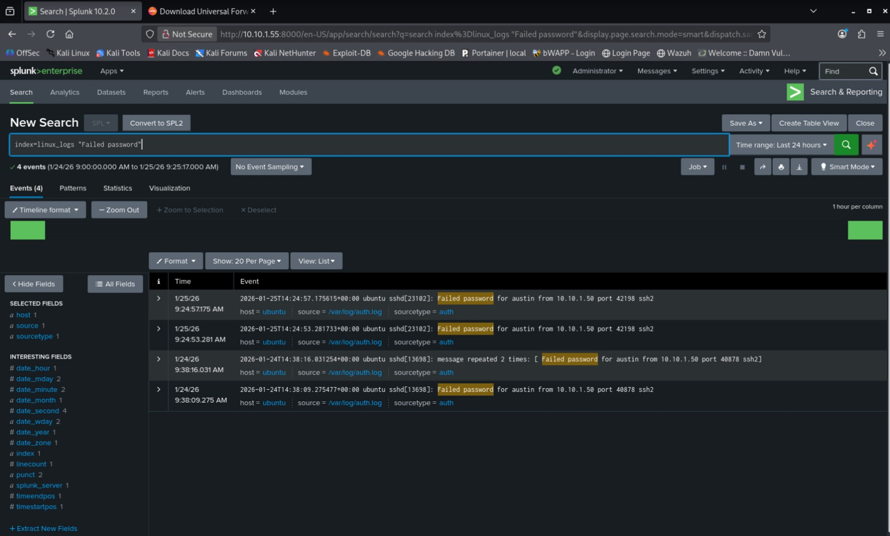
    

This confirmed that:

- SSH authentication failures were being logged correctly
    
- The Universal Forwarder was sending logs in near real time
    
- Splunk searches reflected activity almost immediately
    

---

## Simulating an Attack with Hydra

Next, I wanted to generate a more realistic attack pattern.

On my Kali Linux machine, I created a simple password list with 20 entries called `passwords.txt` and ran Hydra against my Ubuntu server. For simplicity, I assumed the attacker knew my name and therefore my username:

`hydra -l austin -P passwords.txt ssh://10.10.30.50`

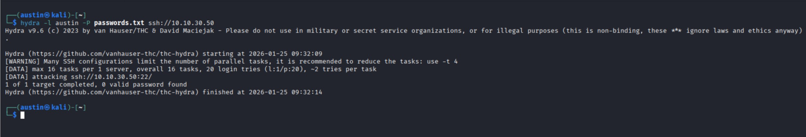
    

Immediately after running Hydra, I returned to Splunk and saw a noticeable spike in failed SSH login attempts.

    

This was a good sign! Splunk was clearly capturing the brute-force behavior generated by Hydra.

---

## Identifying Suspicious Patterns with SPL

To make this more useful from a security perspective, I built a more structured search to identify sources with repeated failures:

`index=linux_logs sourcetype=auth "Failed password" | rex "from (?<src_ip>\d+\.\d+\.\d+\.\d+)" | stats count AS failed_attempts by src_ip | where failed_attempts >= 5`

This search:

- Extracts the source IP address
    
- Counts failed login attempts per source
    
- Flags anything with 5 or more failures
    

The results showed **24 failed login attempts** coming from my Kali Linux machine:

- 20 from the Hydra wordlist
    
- 4 from my earlier manual login attempts
    

That definitely looks suspicious...

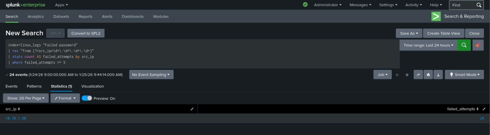
    

---

## Turning the Search into an Alert

Once I confirmed the search worked as expected, I converted it into an alert.

Steps:

- Clicked **Save As → Alert**
    
- Named it **SSH Brute Force Detected**
    

**Alert Configuration:**

- **Type:** Real-time
    
- **Trigger Condition:**
    
    - Number of Results
        
    - Greater than 0
        
    - In 1 minute
        
- **Trigger Once**
    
- **Severity:** Medium
    

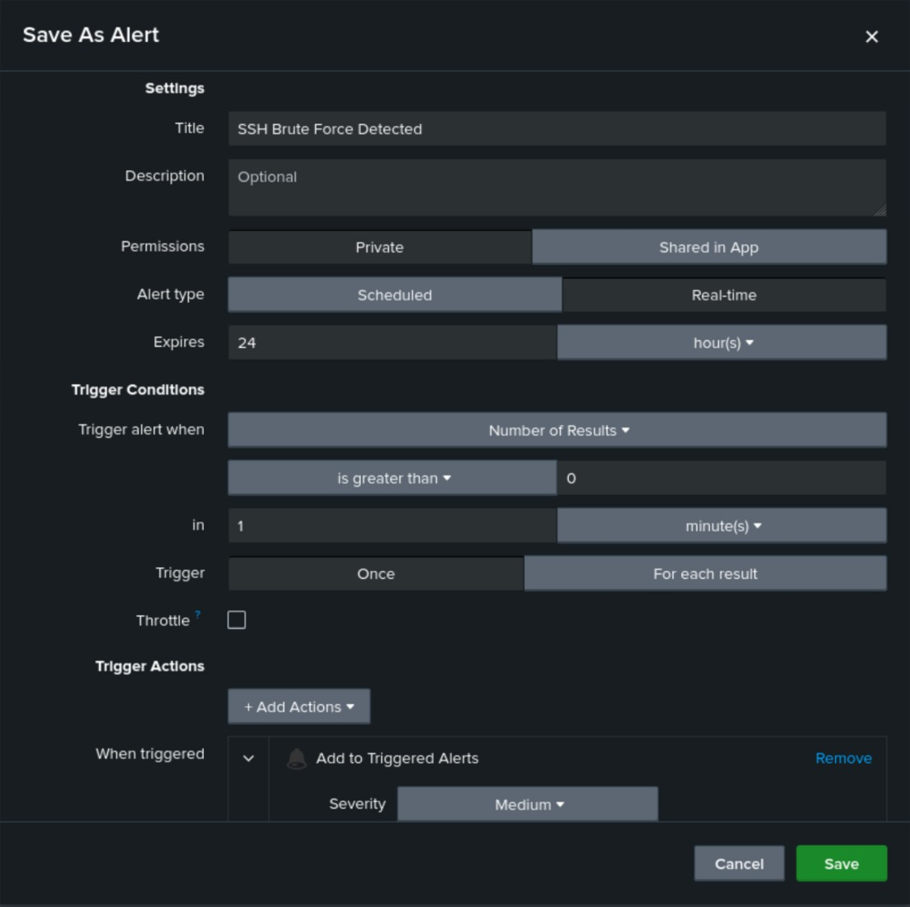
    

---

## Testing and Reducing Alert Noise

To test the alert, I ran the same Hydra command again. This time, I checked **Triggered Alerts** in Splunk.

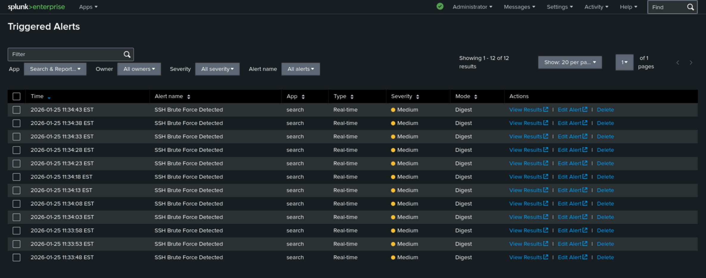
    

I noticed **four separate alert entries**, which makes sense given the threshold of `>= 5` failures and the total number of attempts. However, this raised a concern: what if an attacker used a much larger wordlist, such as rockyou.txt? That could generate a lot of alert noise very quickly.

To address this, I edited the alert to **suppress triggering for 60 seconds**.

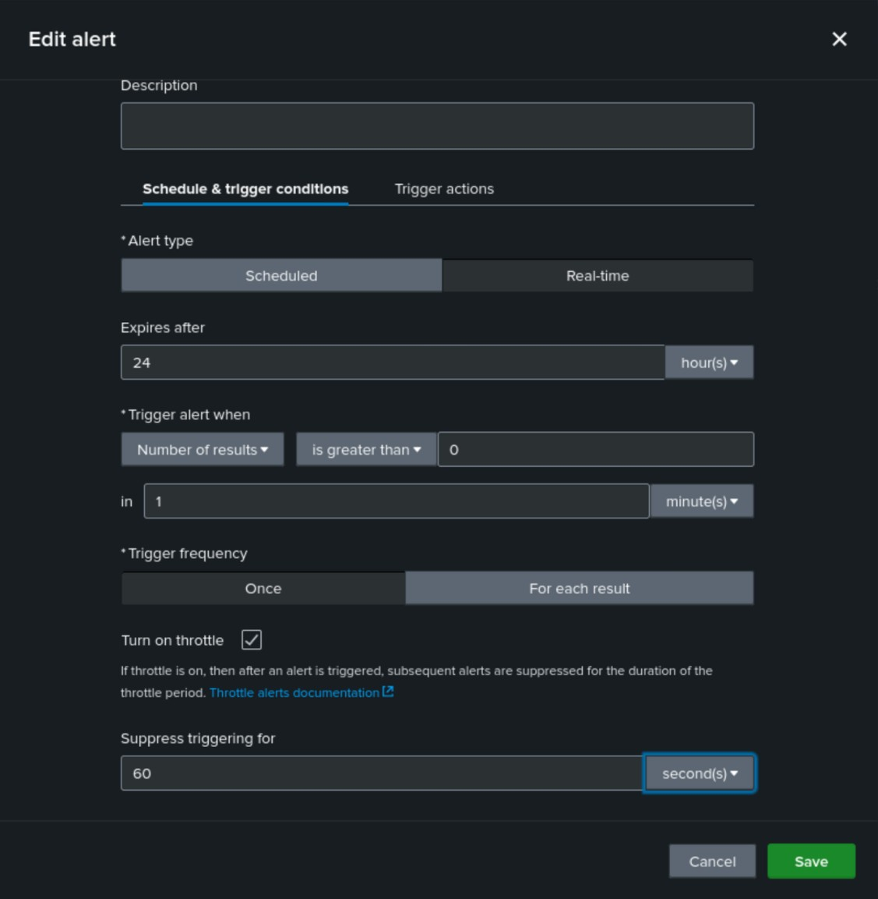
    

After clearing the old alerts and re-running Hydra, only **one alert** triggered.

    

This demonstrated how throttling can significantly reduce noise while still preserving visibility which is an important consideration in real SOC environments.

---

## Expanding the Scenario: Attacking a Second Host

A peek behind the curtain: for my first project, you might notice that my screenshots show my installing the universal forwarder on my Nessus machine, not my Ubuntu server. Well, that was because I had already installed it on my Ubuntu server but still needed some screenshots for the demo. However, this means that I already have another Linux machine already set up to play with in Splunk.

That led to a new question:

> If I attack my Nessus machine with Hydra, will this same alert trigger? And will it look any different?

I ran Hydra against the Nessus machine.

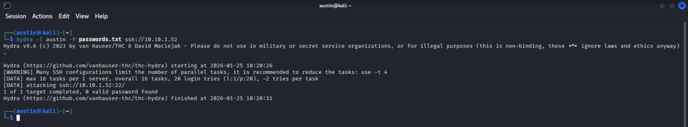
    

But… no alert triggered.

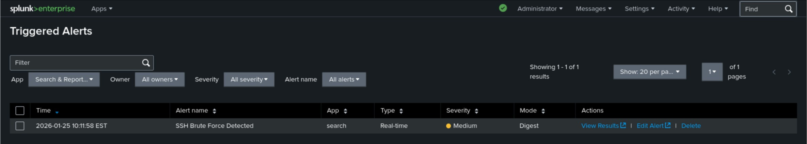
    

---

## Troubleshooting: Why Didn’t the Alert Fire?

I verified that the failed SSH attempts _were_ present in Splunk by running a basic search against `linux_logs`. The events were there, but I noticed something important:

The **sourcetype was `auth-too_small`, not `auth`.**

### Why Did This Happen?

After some research, I learned that if you don’t explicitly define a sourcetype in `inputs.conf`, Splunk uses **learned sourcetyping**.

When Splunk encounters a file with very little data (often fewer than ~100 events), it doesn’t have enough evidence to confidently classify it. Instead of guessing, it appends `-too_small` to the sourcetype (for example, `auth-too_small`).

Because my Nessus machine has very little SSH activity compared to my Ubuntu server, the log file was small enough to trigger this behavior and my alert was filtering specifically on `sourcetype=auth`.

---

## Fixing the Issue

To fix this, I explicitly defined the sourcetype in the Universal Forwarder configuration on the Nessus machine.

I edited `inputs.conf` (located in `/opt/splunkforwarder/etc/system/local/`) and updated it to:

`[monitor:///var/log/auth.log] disabled = 0 index = linux_logs sourcetype = auth`

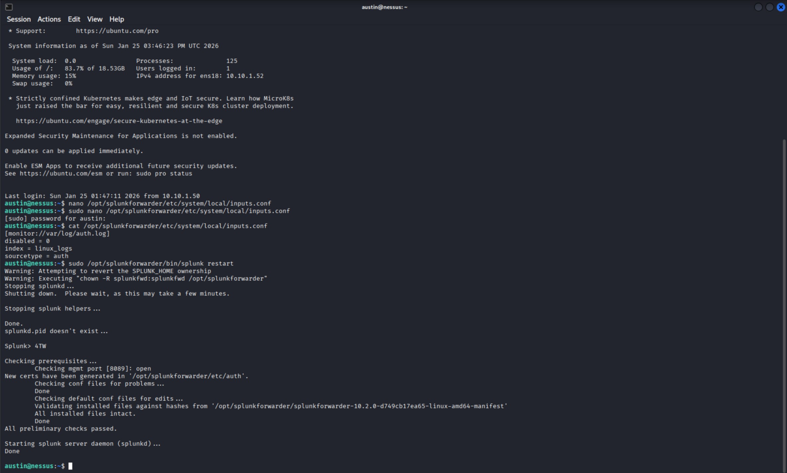
    

After restarting the Splunk Forwarder, new events were consistently labeled as `auth`.

> This approach makes sense in this lab because I’m only ingesting `auth.log`. In a larger environment, I’d need to be careful not to mislabel different data sources.
> 
> Also, in a real production environment, this issue would likely resolve itself naturally due to higher log volume, but this was still a valuable learning opportunity.

---

## Final Validation

After fixing the sourcetype, I ran the Hydra attack again.

This time, the alert triggered exactly as expected.

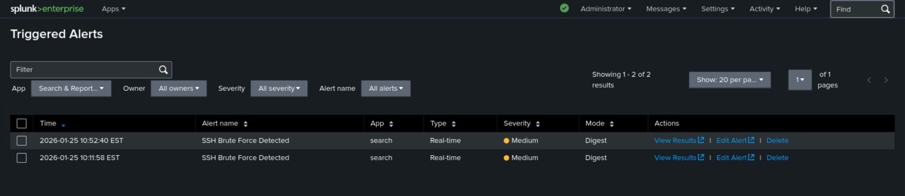
    

When drilling into the alert details, I could clearly see:

- Different **hosts** being targeted (Ubuntu vs Nessus)
    
- The same **source IP** (Kali) attacking multiple systems
    

That’s a strong signal that a single attacker is attempting to compromise multiple hosts and is exactly the kind of behavior this alert was designed to detect.

---

## Wrap-Up

This demo walked through:

- Building a targeted search in Splunk
    
- Turning that search into a real-time alert
    
- Testing alert behavior with realistic attack traffic
    
- Reducing noise through throttling
    
- Troubleshooting sourcetype issues
    
- Validating detection across multiple hosts

I’m looking forward to adding more log sources, simulating additional attack types, and continuing to explore what’s possible with Splunk as I build out this lab further!
