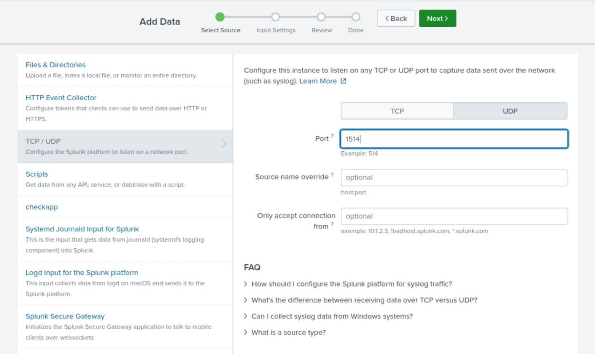
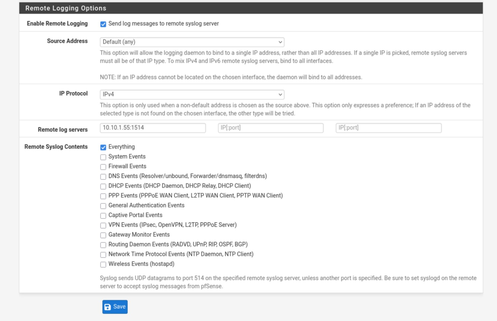
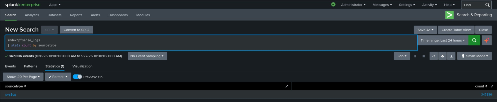
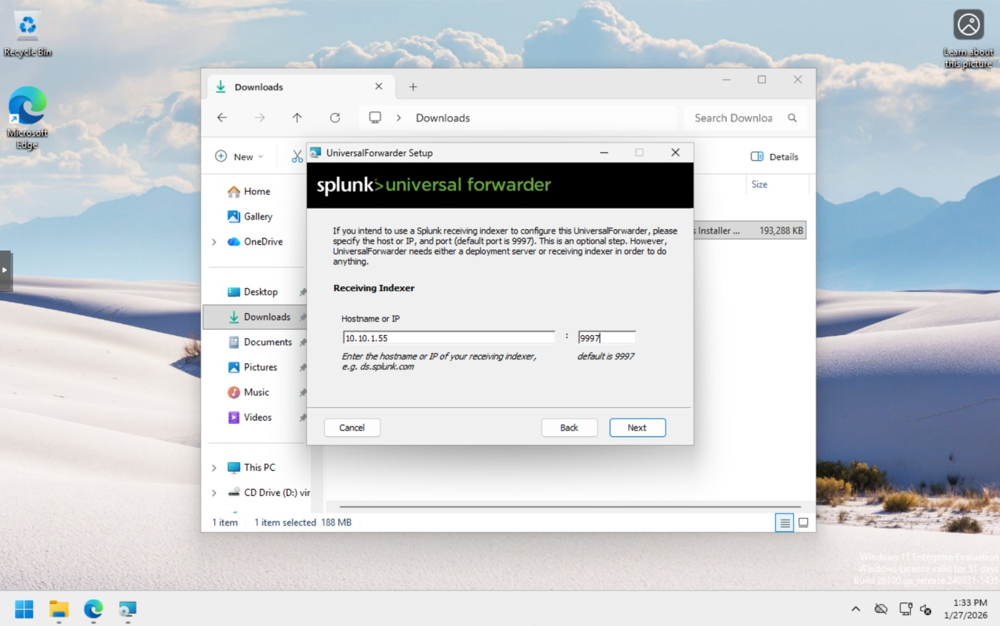
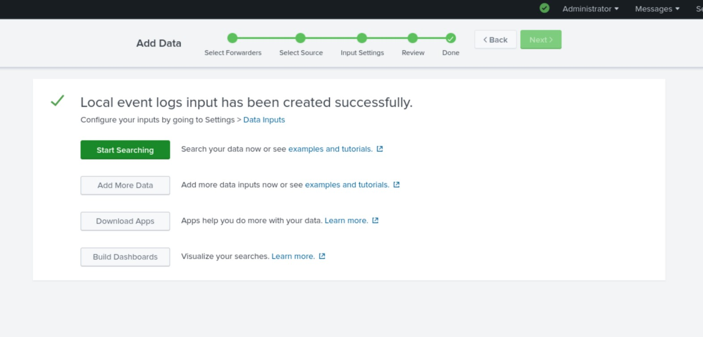
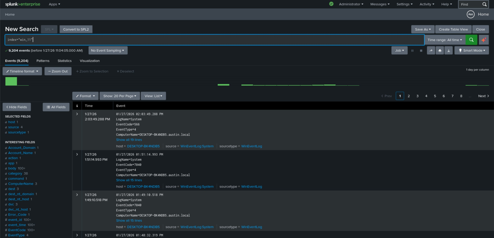
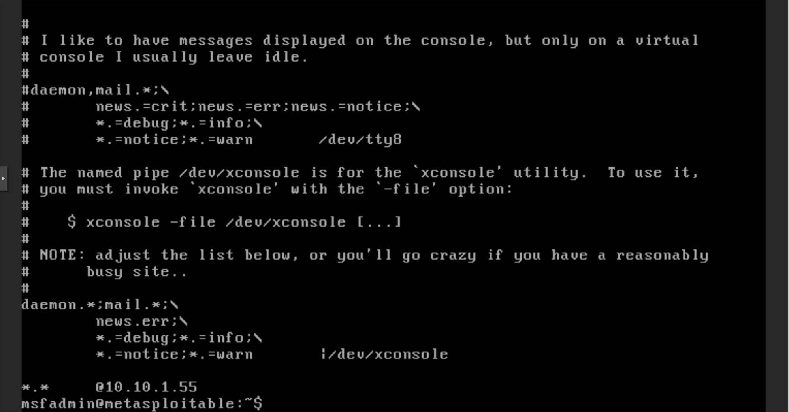
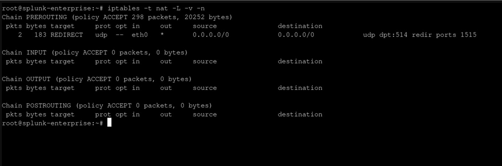
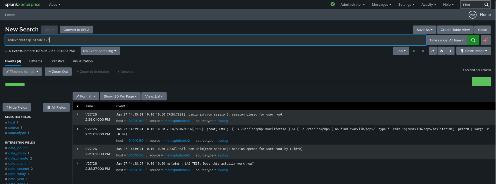

# Multi-Source Log Ingestion in Splunk

## Overview

In my previous two projects, I focused on standing up Splunk, ingesting logs from Windows and Linux systems, and building basic detections and alerts. For this project, I wanted to take the next realistic step toward how Splunk is used in actual SOC environments: **onboarding multiple, very different data sources and making the data usable together**.

Most security teams don’t work with clean, uniform data. They work with a mix of network logs, endpoint logs, server logs, and sometimes intentionally vulnerable systems — all producing events in different formats. The challenge isn’t just ingestion; it’s **normalization and context**.

The goal of this project was to:

- Integrate multiple new data sources into Splunk    
- Ensure logs are stable, searchable, and correctly timestamped    
- Normalize key fields enough to support cross-source investigations    
- Validate that data from different systems can be analyzed together meaningfully    

---

## Lab Environment

This project builds on my existing Splunk lab and includes the following systems:

- **Splunk Enterprise** running in a Proxmox LXC container    
- **pfSense firewall** providing network and firewall logs    
- **Windows 11** workstation with the Splunk Universal Forwarder installed    
- **Metasploitable 2** Linux VM acting as a deliberately vulnerable target    
- **Kali Linux** used to generate attack traffic    

Each system produces very different log formats, which makes this a useful normalization exercise.

---

## Data Source Onboarding

### pfSense Firewall Logs

To ingest firewall and network activity, I configured pfSense to forward logs to Splunk using **syslog**.

#### Phase 1: Enable UDP Receiving in Splunk

First, I configured Splunk to listen for incoming syslog traffic.

1. Logged into the **Splunk Web Interface**
    
2. Navigated to **Settings → Data Inputs**
    
3. Clicked **Add New** next to **UDP**
    
4. Set the following:    
    - **Port:** `1514`        
    - **Source name override:** `pfsense`        
    
5. Clicked **Next**
    
6. Set:    
    - **Source Type:** `syslog`        
    - **App Context:** Search & Reporting        
    - **Index:** Created a new index called `pfsense_logs`
    
7. Clicked **Review** and **Submit**    

---

#### Phase 2: Configure pfSense Remote Logging

Next, I configured pfSense to send logs to Splunk.

1. Logged into the **pfSense WebGUI**
    
2. Navigated to **Status → System Logs → Settings**
    
3. Under **General Logging Options**, set:
    
    - **Log Message Format:** syslog (RFC 5424, RFC 3339 timestamps)
        
4. Under **Remote Logging Options**:
    
    - Enabled **Remote Logging**        
    - **Remote Log Servers:** `10.10.1.55:1514`        
    - **Remote Syslog Contents:** Everything (this can be limited to save license space)
    - > Note from the future: I realized that choosing everything generated a TON of logs, so I did end up toning this down to Firewall Events and General Authentication Events.
5. Clicked **Save**    

**Validation search:**

`index=pfsense_logs | stats count by sourcetype`

---

### Windows 11 Endpoint Logs

Next, I integrated a Windows 11 system using the Splunk Universal Forwarder. While similar to my earlier Windows Server ingestion, this added endpoint-style telemetry rather than server-centric logs.

Key points:

- Universal Forwarder installed on Windows 11    
- Security, System, and Application event logs forwarded    
- Logs routed to a dedicated index (`win_11`)    
- Verified timestamps and event volume    

Initially, I couldn’t see the Windows 11 system in Splunk. After some troubleshooting, I realized I needed to install the **Splunk Add-on for Microsoft Windows** on my Splunk instance.

This also helped explain issues I ran into during Project 001 with my Windows Server 2025 machine. At the time, I had manually configured log forwarding, which worked but wasn’t ideal. Installing the proper add-on clarified the intended workflow.

To configure the Windows 11 endpoint properly:

1. In Splunk, navigate to **Settings → Data Inputs**
    
2. Under **Forwarded Inputs**, click **Add New** next to **Windows Event Logs**
    
3. Select the Windows 11 host (in my case, `DESKTOP-BK4NDB5`)
    
4. Create a new server class (I used `win-11`)
    
5. Select **Add all** logs (this can be scoped down if needed)
    
6. Create a new index named `win_11`
    
7. Review and submit    

After a few moments, data began populating.

**Validation search:**

`index=win_11`

Additional validation:

`index=win_11 | stats count by EventCode | sort - count`

> At this point, I cleaned up my environment by removing stale forwarder entries under **Settings → Agent Management** and reconfiguring my Windows Server 2025 system using the same method. The earlier manual approach was good practice, but this is the cleaner and more scalable solution.

---

### Metasploitable 2 Logs

My final goal was to ingest logs from the Metasploitable 2 VM. Since this system runs a legacy Linux distribution that isn’t supported by current versions of the Universal Forwarder, I opted to forward logs via **syslog** instead.

In a real environment, a system this outdated would be upgraded or isolated. In this lab, its age is intentional.

Splunk was already configured to receive syslog traffic from pfSense, so I reused that capability.

#### Initial Troubleshooting

This took some trial and error:

- Metasploitable’s `sysklogd` did not appear to support custom destination ports    
- It defaulted to sending logs on UDP port 514    
- Splunk cannot bind directly to port 514    

To work around this, I used **iptables** on the Splunk LXC to redirect incoming syslog traffic from port 514 to port 1515.

---

#### Configure Metasploitable 2 to Send Logs

1. Edit the syslog configuration:    
    `sudo nano /etc/syslog.conf`
    
2. Add the following line (tab-separated):    
    `*.* @<SPLUNK_IP>`
    
3. Restart syslog:    
    `sudo /etc/init.d/sysklogd restart`
    

---

#### Configure Port Redirection on Splunk LXC

First, install iptables:

`apt update  apt install iptables -y`

Then redirect syslog traffic:

`sudo iptables -t nat -A OUTPUT -p udp --dport 514 -j DNAT --to-destination 10.10.1.55:1515`

Verify:

`iptables -t nat -L -v -n`

**Validation search:**

`index=metasploitable2`

At this point, logs from Metasploitable 2 were successfully flowing into Splunk.

> Editing note: I now realize I need to make the iptables change persistent, which I didn't do here.  The easiest way would be to install and use iptables-persistent which I will do in the background between projects.

---

## Wrap-Up

I originally planned to build cross-host searches correlating activity across pfSense, Windows, and Linux systems, but I’m running short on time today. I’ll explore that in a future project.

For now, this project successfully demonstrates:

- Multi-source log ingestion    
- Handling different log transport methods    
- Troubleshooting legacy systems
- Laying the groundwork for normalization and correlation

## Final Note

I realize that the way I made my indexes is very messy and is not likely what you would see in a professional setting. In this case, it is a product of me building the airplane as I fly it, so to speak. I was learning how to use the platform while putting these projects together, so some best practices didn't quite make it in. I apologize if this is confusing to anyone, but I will likely clean everything up in a future project or I will do it in the background between projects. Either way, thanks for reading!
