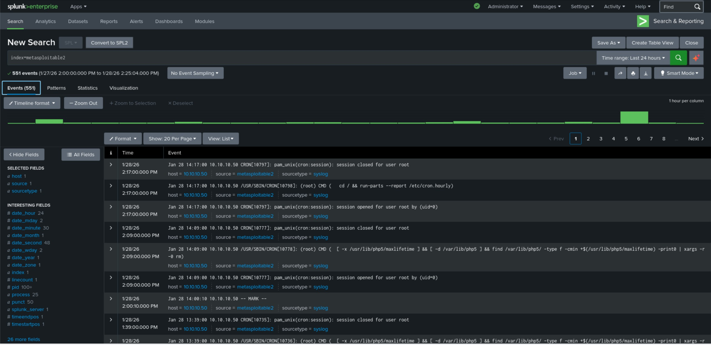
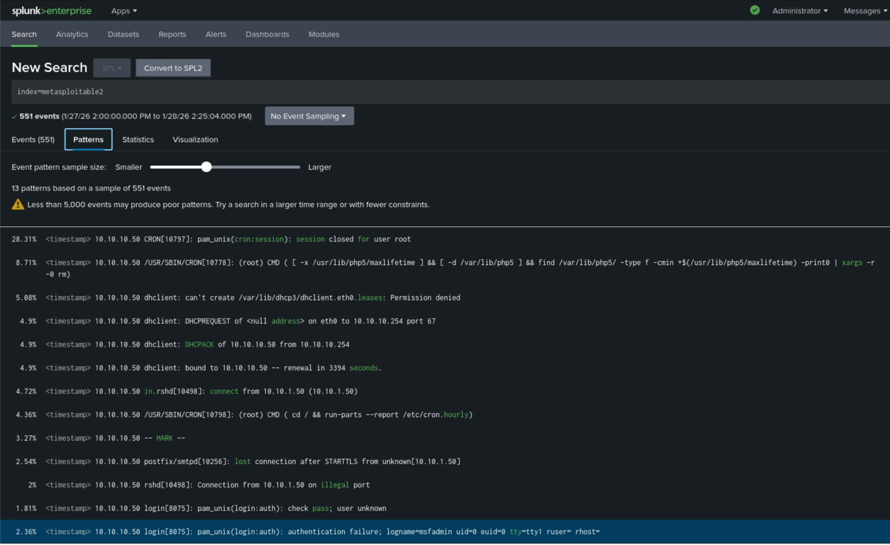
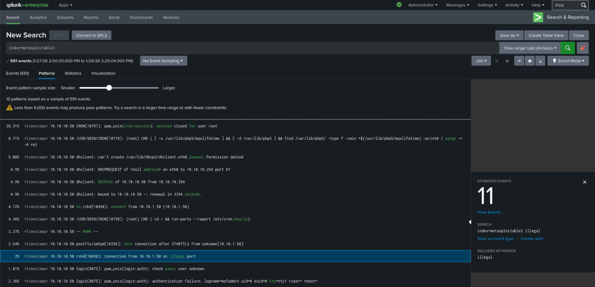
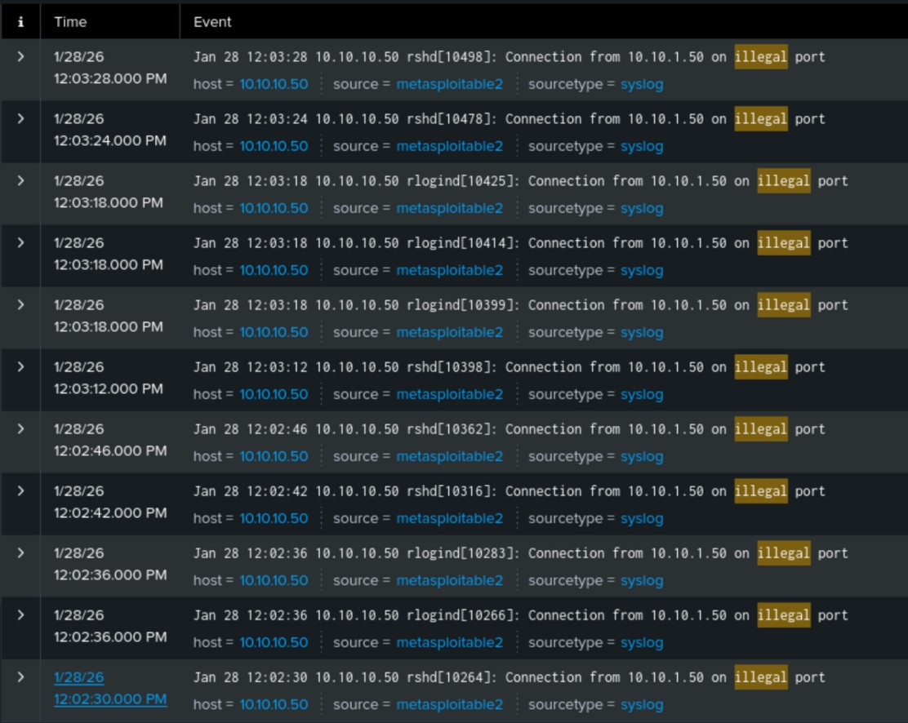
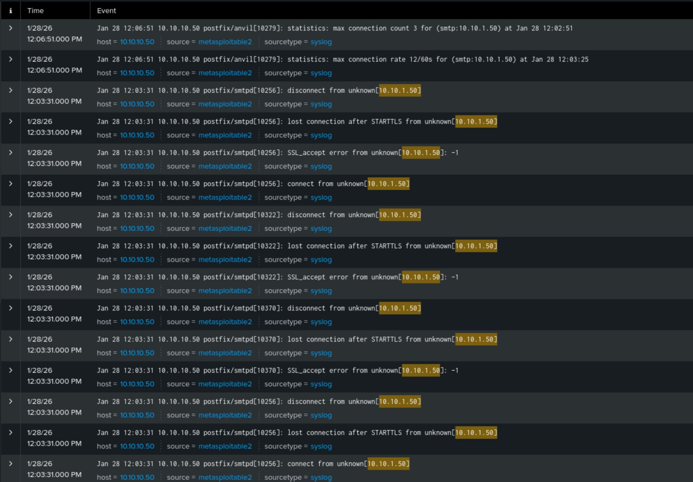
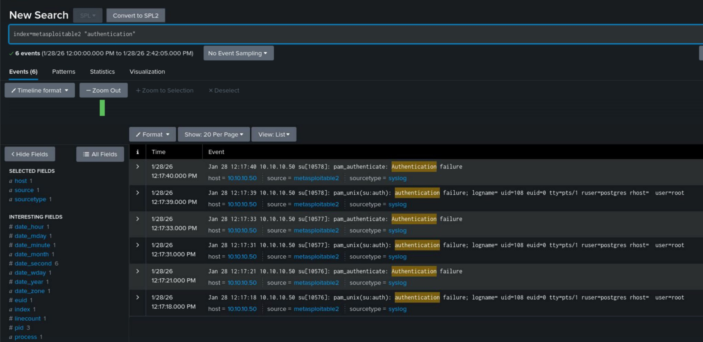
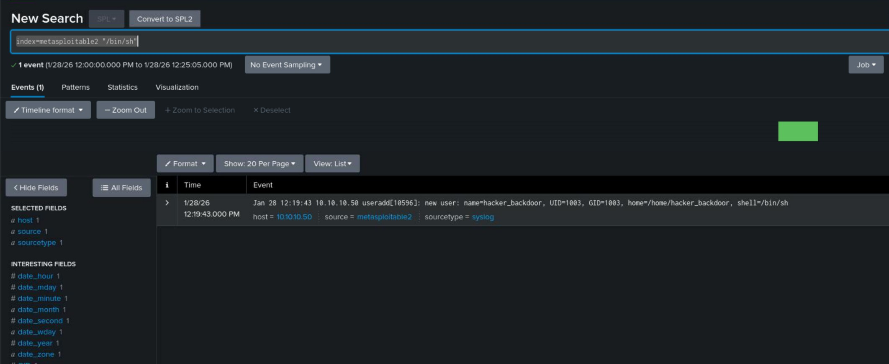

## Notes Before Starting

**First note:**  
I am going to stop including a separate resources document with each project and instead sprinkle in any relevant links throughout my write-ups. I think this makes more sense and makes it easier to see what references are relevant to which part of the write-up.

**Second note:**  
I am on a limited free trial of Splunk, so I want to make the most of it while I have access to it. I will be diving into other tools and other kinds of projects later on.

For this project, my goal is to hop onto my Kali Linux machine and start attacking my Metasploitable 2 machine to see what information can be seen in Splunk.

---

## Overview

In the previous projects, I focused on getting data into Splunk, building detections, and onboarding multiple log sources in a way that more closely resembles a real SOC environment. For this project, I wanted to answer a natural next question:

**What does attacker activity actually look like in the logs, and how would an analyst investigate it?**

Rather than installing a new tool or building another alert in isolation, the goal here was to generate realistic attacker behavior in a controlled lab and then follow that activity end-to-end using Splunk. Offensive tooling is used only as a way to create telemetry. The focus of this project is entirely defensive.

This project walks through exploiting a deliberately vulnerable system and then using Splunk to identify, contextualize, and reconstruct what happened.

Quick reminder of what this lab environment looks like:


---

## Part 1: Attacker Activity

In order to simulate hacker activity, I hopped onto my Kali Linux machine and started treating the Metasploitable 2 machine like it was a (very easy) Hack The Box lab.

The first step was to run a simple Nmap scan and, oh boy, there are tons of open ports and attack vectors on this bad boy.

```
┌──(austin㉿kali)-[~]
└─$ sudo nmap -sVC 10.10.10.50 
Starting Nmap 7.98 ( https://nmap.org ) at 2026-01-28 12:03 -0500
Nmap scan report for 10.10.10.50
Host is up (0.00023s latency).
Not shown: 977 closed tcp ports (reset)
PORT     STATE SERVICE     VERSION
21/tcp   open  ftp         vsftpd 2.3.4
|_ftp-anon: Anonymous FTP login allowed (FTP code 230)
| ftp-syst: 
|   STAT: 
| FTP server status:
|      Connected to 10.10.1.50
|      Logged in as ftp
|      TYPE: ASCII
|      No session bandwidth limit
|      Session timeout in seconds is 300
|      Control connection is plain text
|      Data connections will be plain text
|      vsFTPd 2.3.4 - secure, fast, stable
|_End of status
22/tcp   open  ssh         OpenSSH 4.7p1 Debian 8ubuntu1 (protocol 2.0)
| ssh-hostkey: 
|   1024 60:0f:cf:e1:c0:5f:6a:74:d6:90:24:fa:c4:d5:6c:cd (DSA)
|_  2048 56:56:24:0f:21:1d:de:a7:2b:ae:61:b1:24:3d:e8:f3 (RSA)
23/tcp   open  telnet      Linux telnetd
25/tcp   open  smtp        Postfix smtpd
|_ssl-date: 2026-01-28T17:03:32+00:00; +1s from scanner time.
| sslv2: 
|   SSLv2 supported
|   ciphers: 
|     SSL2_RC2_128_CBC_EXPORT40_WITH_MD5
|     SSL2_DES_192_EDE3_CBC_WITH_MD5
|     SSL2_RC4_128_EXPORT40_WITH_MD5
|     SSL2_DES_64_CBC_WITH_MD5
|     SSL2_RC2_128_CBC_WITH_MD5
|_    SSL2_RC4_128_WITH_MD5
| ssl-cert: Subject: commonName=ubuntu804-base.localdomain/organizationName=OCOSA/stateOrProvinceName=There is no such thing outside US/countryName=XX
| Not valid before: 2010-03-17T14:07:45
|_Not valid after:  2010-04-16T14:07:45
|_smtp-commands: metasploitable.localdomain, PIPELINING, SIZE 10240000, VRFY, ETRN, STARTTLS, ENHANCEDSTATUSCODES, 8BITMIME, DSN
53/tcp   open  domain      ISC BIND 9.4.2
| dns-nsid: 
|_  bind.version: 9.4.2
80/tcp   open  http        Apache httpd 2.2.8 ((Ubuntu) DAV/2)
|_http-server-header: Apache/2.2.8 (Ubuntu) DAV/2
|_http-title: Metasploitable2 - Linux
111/tcp  open  rpcbind     2 (RPC #100000)
| rpcinfo: 
|   program version    port/proto  service
|   100000  2            111/tcp   rpcbind
|   100000  2            111/udp   rpcbind
|   100003  2,3,4       2049/tcp   nfs
|   100003  2,3,4       2049/udp   nfs
|   100005  1,2,3      32905/udp   mountd
|   100005  1,2,3      54239/tcp   mountd
|   100021  1,3,4      49295/tcp   nlockmgr
|   100021  1,3,4      59011/udp   nlockmgr
|   100024  1          36778/tcp   status
|_  100024  1          48786/udp   status
139/tcp  open  netbios-ssn Samba smbd 3.X - 4.X (workgroup: WORKGROUP)
445/tcp  open  netbios-ssn Samba smbd 3.0.20-Debian (workgroup: WORKGROUP)
512/tcp  open  exec        netkit-rsh rexecd
513/tcp  open  login       OpenBSD or Solaris rlogind
514/tcp  open  tcpwrapped
1099/tcp open  java-rmi    GNU Classpath grmiregistry
1524/tcp open  bindshell   Metasploitable root shell
2049/tcp open  nfs         2-4 (RPC #100003)
2121/tcp open  ftp         ProFTPD 1.3.1
3306/tcp open  mysql       MySQL 5.0.51a-3ubuntu5
| mysql-info: 
|   Protocol: 10
|   Version: 5.0.51a-3ubuntu5
|   Thread ID: 20
|   Capabilities flags: 43564
|   Some Capabilities: Support41Auth, ConnectWithDatabase, SupportsTransactions, SupportsCompression, Speaks41ProtocolNew, SwitchToSSLAfterHandshake, LongColumnFlag
|   Status: Autocommit
|_  Salt: lWLVKTD7)eEgVZ@o1EEl
5432/tcp open  postgresql  PostgreSQL DB 8.3.0 - 8.3.7
| ssl-cert: Subject: commonName=ubuntu804-base.localdomain/organizationName=OCOSA/stateOrProvinceName=There is no such thing outside US/countryName=XX
| Not valid before: 2010-03-17T14:07:45
|_Not valid after:  2010-04-16T14:07:45
|_ssl-date: 2026-01-28T17:03:32+00:00; +1s from scanner time.
5900/tcp open  vnc         VNC (protocol 3.3)
| vnc-info: 
|   Protocol version: 3.3
|   Security types: 
|_    VNC Authentication (2)
6000/tcp open  X11         (access denied)
6667/tcp open  irc         UnrealIRCd
8009/tcp open  ajp13       Apache Jserv (Protocol v1.3)
|_ajp-methods: Failed to get a valid response for the OPTION request
8180/tcp open  http        Apache Tomcat/Coyote JSP engine 1.1
|_http-title: Apache Tomcat/5.5
|_http-server-header: Apache-Coyote/1.1
|_http-favicon: Apache Tomcat
Service Info: Hosts:  metasploitable.localdomain, irc.Metasploitable.LAN; OSs: Unix, Linux; CPE: cpe:/o:linux:linux_kernel

Host script results:
|_clock-skew: mean: 1h15m00s, deviation: 2h30m00s, median: 0s
| smb-security-mode: 
|   account_used: <blank>
|   authentication_level: user
|   challenge_response: supported
|_  message_signing: disabled (dangerous, but default)
| smb-os-discovery: 
|   OS: Unix (Samba 3.0.20-Debian)
|   Computer name: metasploitable
|   NetBIOS computer name: 
|   Domain name: localdomain
|   FQDN: metasploitable.localdomain
|_  System time: 2026-01-28T12:03:24-05:00
|_smb2-time: Protocol negotiation failed (SMB2)
|_nbstat: NetBIOS name: METASPLOITABLE, NetBIOS user: <unknown>, NetBIOS MAC: <unknown> (unknown)

Service detection performed. Please report any incorrect results at https://nmap.org/submit/ .
Nmap done: 1 IP address (1 host up) scanned in 20.20 seconds
```

From this scan alone, it’s immediately obvious that Metasploitable 2 exposes a huge attack surface. For the sake of simplicity, I decided to go after Samba.

---

### Exploiting Samba with Metasploit

I searched for Samba-related exploits and chose the **Samba "username map script" command execution exploit**.

```
msf > search samba 
msf > use exploit/multi/samba/usermap_script
```

After setting the target and payload options, I ran the exploit and successfully obtained a shell.

```
[*] Command shell session 1 opened  
whoami  
root
```

I then upgraded the shell for usability.

`python -c 'import pty; pty.spawn("/bin/bash")'`

---

### Post-Exploitation Activity

Now I wanted to do some attacker actions that I might reasonably expect to show up in logs. I won’t walk through every command, but here’s what I did at a high level:

- Pivoted to the `postgres` account    
- Input some bad passwords trying to get back to root    
- Regained root access    
- Viewed `/etc/shadow` and `/etc/passwd
- Added a new user called `hacker_backdoor`    
- Attempted to clear logs (and my tracks)    
- Left a file on the root desktop called `yougothacked`    
- Exited the system    

This wouldn’t exactly be the work of a master hacker. The goal was simply to generate activity and see what Splunk could observe.

---

## Part 2: Detection in Splunk

Now I switched roles and played the part of an analyst logging into Splunk to check for suspicious activity.

At this point, the triggered alerts dashboard was empty. That makes sense because the only alert I’ve built so far in this series is for SSH brute-force activity.

In a real environment, I’d likely have alerts for things like:

- Suspicious process execution    
- New user creation    
- Privilege escalation    

But for the sake of this exercise, I decided to start with manual investigation.

---

### Initial Search

Since Metasploitable 2 represents an old server, I want to keep a close eye on it.

`index=metasploitable2`



At first glance, nothing stands out. It's mostly cron jobs and DHCP requests.

I then clicked on **Patterns**.



Splunk warns that fewer than 5,000 events may produce poor patterns, which is fair. This system hasn’t been running long and hasn’t generated much log volume.

Even so, a couple of patterns immediately catch my eye:

- **2% of logs show a connection from 10.10.1.50 on an illegal port**
    
- **2.36% show an authentication failure**  
    _(Not entirely accurate because the pattern is matching “TTY”, but still useful context)_    

---

### Investigating the Suspicious IP

Clicking on the illegal port pattern gives me the option to view the events.




Right away, it looks like around **12:02 PM**, someone ran a scan against this machine. It may have happened again shortly afterward. The source IP appears to be **10.10.1.50**.

That alone is enough to justify further investigation.

---

### Pivoting on the Attacker IP

I searched for events involving that IP.

`index=metasploitable2 "10.10.1.50"`



Most of the results look scan-related, but did the attacker stop there?

To find out, I adjusted the time range to start at **12:00 PM** and searched for authentication-related events.

`index=metasploitable2 "authentication"`



Uh oh. This is definitely suspicious. 

---

### Looking for Command Execution

Next, I searched for evidence of execution activity.

`index=metasploitable2 "/bin/sh"`



Right about now, it becomes clear that a new user account named **`hacker_backdoor`** was created. Subtle naming aside, the intent is obvious. At this point, I would escalate this as a confirmed compromise.

Based on this, I’d confidently say the system would need to be secured immediately.

---

## Limitations and Takeaways

This exercise didn’t go exactly to plan, and I think that’s largely due to the limitations of **syslog**.

We were able to see:

- Scanning activity    
- Authentication-related events    
- Evidence of compromise    

But even after manually reviewing logs, I could not find:

- Evidence of the actual exploit execution    
- Evidence of `/etc/passwd` or `/etc/shadow` being read    
- Evidence of log clearing    
- Evidence of the file being written to disk    

I’m sure the `yougothacked` file would be visible on the host itself, but there was no trace of it in the logs.

---

## Final Thoughts

This turned out to be a really useful learning experience.

While we had enough visibility to conclude the system was compromised, it also clearly demonstrates how much better modern logging and monitoring solutions are.

If this were a modern system with more robust telemetry, we would likely be able to:

- Detect exploitation more clearly    
- Alert on new account creation    
- Monitor sensitive file access    
- Detect suspicious file writes    

In my next project, I want to try this again with a more realistic, modern system to really showcase what Splunk is capable of when it has richer data to work with.

Stay tuned!
