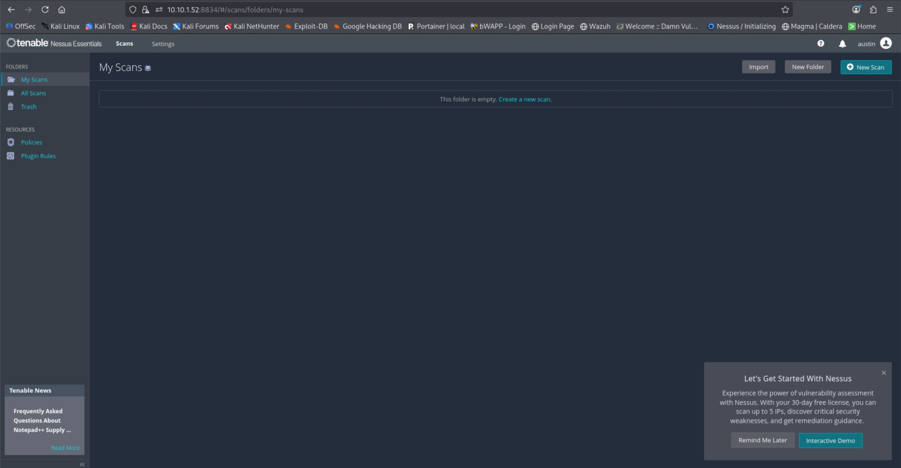
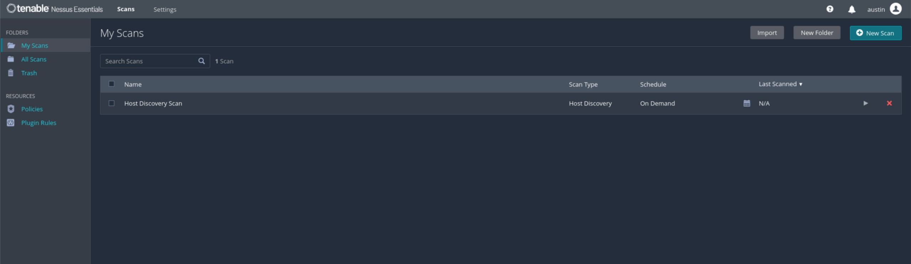
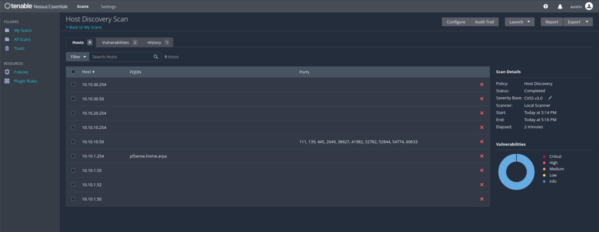
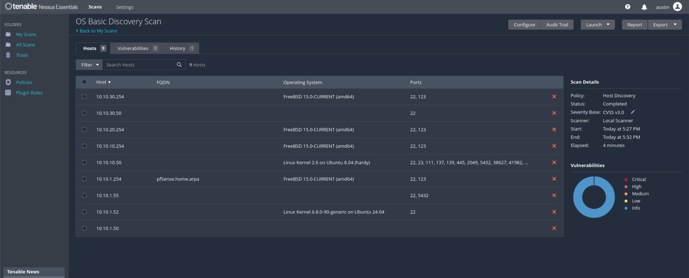
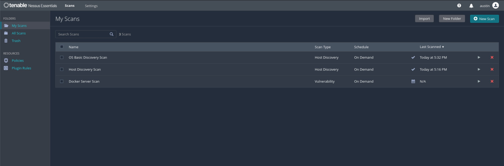
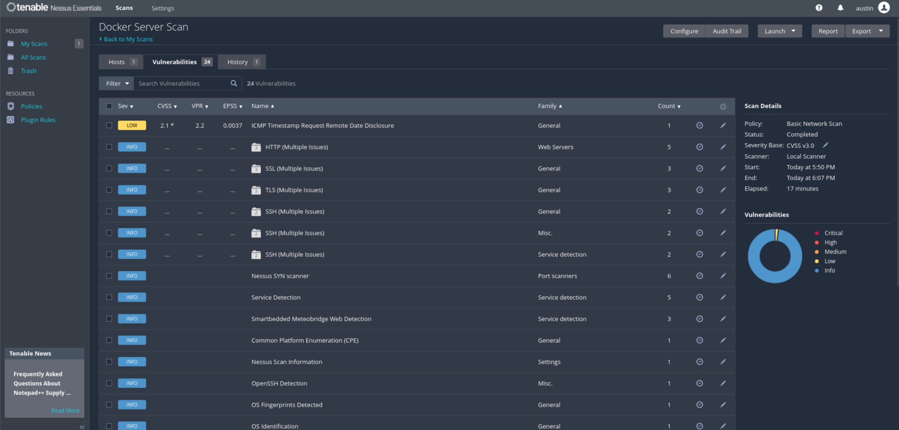
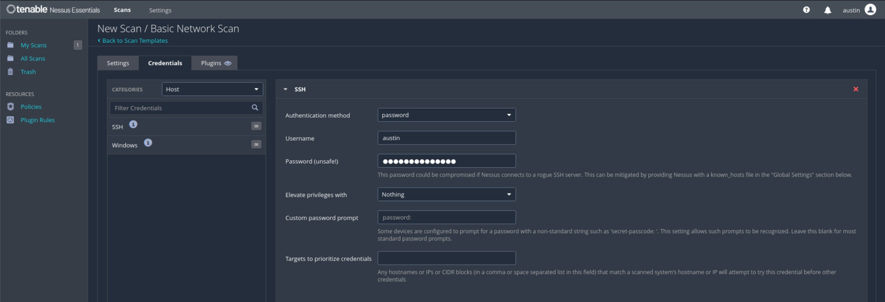
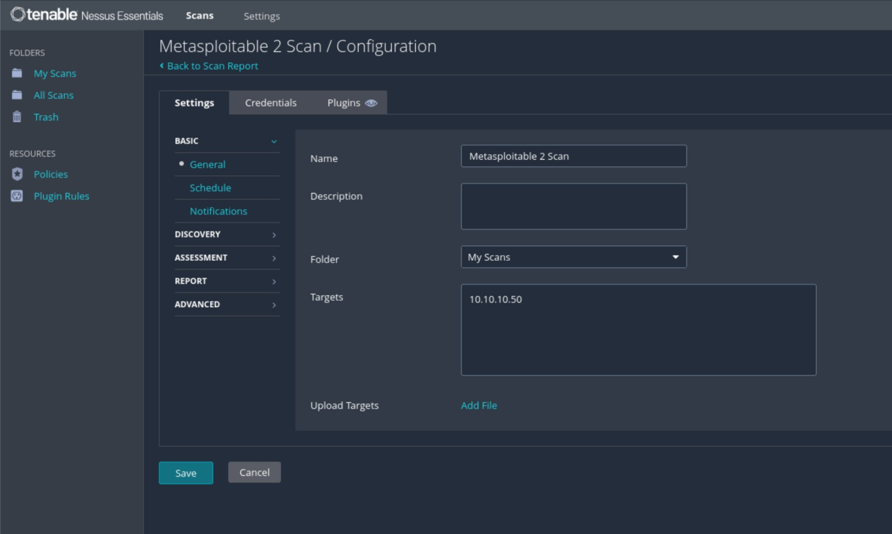
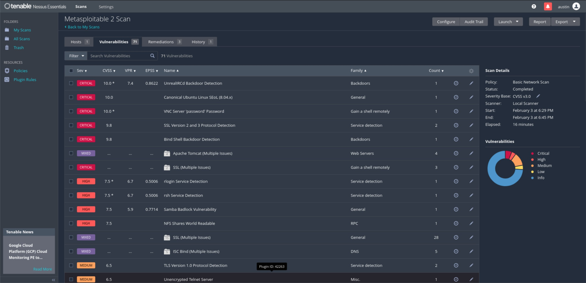
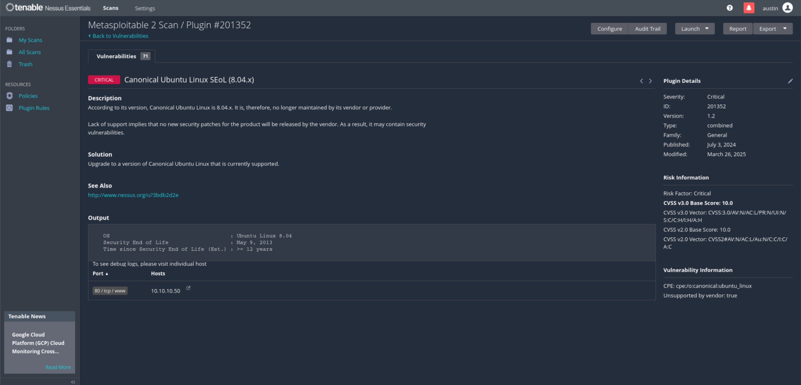

# Basic Vulnerability Scanning with Nessus

## Overview

For this project, I wanted to step back from detection engineering and focus on another core defensive security skill: vulnerability assessment.

The goal here is not to find zero-days or perform advanced exploitation, but to:
- Deploy Nessus in my lab environment
- Run a Host Discovery scan to see what Nessus can find
- Run some basic authenticated and unauthenticated scans
- Understand the types of findings Nessus produces

This mirrors how Nessus is often used in real environments as part of a broader vulnerability management program.

---
## Lab Environment

Systems involved in this project:

- **Nessus Essentials** (10.11.1)
- **Ubuntu Server running Docker**
- **Metasploitable 2**
- **Kali Linux** (management only)

And here is a diagram of my lab setup:


---
## Nessus Installation and Initial Setup

For my lab purposes, spinning up Nessus was really not all that difficult. Here is what I did:

- Created an Ubuntu server VM on Proxmox (24.04.3)
- Once you're logged into the server via CLI, use the following command to download the Nessus package.
```
curl --request GET \ --url 'https://www.tenable.com/downloads/api/v2/pages/nessus/files/Nessus-10.11.1-ubuntu1604_amd64.deb' \ --output 'Nessus-10.11.1-ubuntu1604_amd64.deb'
```

> Note: This will change as the version changes. Reference the Nessus website and documentation for the most up to date version. I followed the directions here to get everything up and running: https://docs.tenable.com/nessus/Content/InstallNessusLinux.htm

- Then, we just need to run the following command to get Nessus set up:
```
dpkg -i Nessus-<version number>-debian6_amd64.deb
```

- Once the installation is complete, run the following command to start the Nessus daemon:
```
systemctl start nessusd
```

From there, you should be able to log on to the web interface on another machine in your network (I use my Kali linux machine for this).

> To access a remotely installed Tenable Nessus instance, go to https:// \<remote IP address\>:8834 (for example, https://111.49.7.180:8834).

- You will need to configure Nessus when you first navigate to the web interface. It's pretty self explanatory, but for reference, I used the documentation here to get things set up the way I wanted: https://docs.tenable.com/nessus/Content/ConfigureNessus.htm
- Once you are all set up, you can log in and see the glorious dashboard!



---
## Scan Planning

Before I jump right into scanning, let's talk about what I want to do in this project and why. Since this is just a basic usage project (I would like to dive deeper in another project), I will only be scanning my Docker server and my Metasploitable 2 machine. The reason I'm choosing these two as examples is because one should be a pretty good example of what a basic scan looks like against a relatively secure system (my Docker server which is fully up to date) and what a basic scan looks like on a very vulnerable system (the Metasploitable 2 system).

Here is my plan on what scans I'm going to run today:
- A Host Discovery scan to see what it can find on my network
- A Basic Network Scan on the Docker server
- A Credentialed Basic Network Scan on the Docker server
- A Basic Network Scan on the Metasploitable 2 machine

With that, let's dive in!

---
## Scan Configuration (Host Discovery Scan)

Once you are logged in, we can click on + New Scan in the top right corner to get started with configuring our first scan. Let's start with our Host Discovery scan which is in the Discovery section of the templates page.

I'm just going to name this Host Discovery Scan for simplicity and then put a brief description. Next, I need to input my targets. I'm going to see if I can scan my entire cyber lab, so that's going to include 10.10.1.0/24, 10.10.10.0/24, 10.10.20.0/24, and 10.10.30.0/24.

I'm not going to mess with scheduling this scan or having it send me notifications, so let's move on to the Discovery tab. Here, we will keep the scan type set to Host enumeration so that it will just find machines that are up. However, let's take note that we could have Nessus scan for open ports or do some OS discovery if we wanted.

For simplicity, I'm going to leave the Report and Advanced tabs set to their defaults, so we are ready to save this scan.

And now we can see it on the dashboard!



Let's hit the Launch button and see what happens.

---
## Scan Execution

I hit launch at 5:14 PM and it completed the scan at 5:16 PM

Let's dive into the results!



---
## Results Overview

Well, this looks like it went pretty well. In total, it found 9 hosts, so let's take a closer look and see if it missed anything. It also looks like it did a little bit of port scanning anyway, which is nice.

First of all, the 4 IP addresses ending in .254 are actually all my pfSense firewall. The reason it shows up like this is because I have the .254 addresses set up as the gateways for each respective VLAN. 

Just for funsies, I'm going to create another Host Discovery scan that does OS detection and run it to see what it comes up with. Then we will compare with what is actually running in my lab.



Eh, not bad, but not perfect either. It looks like it identified the pfSense OS, the Metasploitable 2 OS, and the Nessus OS. It had a little trouble with the remaining 3.

Here is what is actually running on these IPs:

10.10.1.50 - Kali Linux
10.10.1.52 - Nessus (It found itself)
10.10.1.55 - Splunk
10.10.10.50 - Metasploitable 2
10.10.30.50 - Docker server

Well, these 2 scans didn't miss anything as I didn't have anything else running in my lab at the time. I would have liked to have my Windows machines up for these tests, but they are out of commission for the moment. Anyway, moving on!

---
## Scan Configuration (Basic Network Scan on Docker Server)

Alright, next up we are going to do a Basic Network Scan on the Docker server. We're going to try it without credentials to see what it finds and then compare with a credentialed scan. Let's click + New Scan in the top right again and then select the Basic Network Scan to get started.

Here we will give it a name of Docker Server Scan and put in the IP address of 10.10.30.50 for the target. I'm actually going to leave everything else as default, so we can go ahead and save and then see it in the dashboard.



Let's launch it!

---
## Scan Execution

I hit launch at 5:50 PM and it completed the scan at 6:07 PM, so it definitely took a little longer than the discovery scans.

Let's take a look at what it found. Since this is a vulnerability scan, we should see some info on what kinds of vulnerabilities it finds.

---
## Results Overview

Okay, now that the scan is done, if we click on it and then go to the vulnerabilities tab, we will see a good breakdown of what it found. In this instance, there are 23 items that are tagged as Info and 1 as a Low severity vulnerability. Not bad! Now, we can go in and look at the details of this vulnerability, do some remediation, and run the scan again to make sure we fixed the issue, but I think that is for another project.



Next, let's run the same scan but with credentials to see what it can find. While setting up the scan, click the credentials tab to get this set up. I'm going to have it authenticate over SSH with my username and password. There is a note there that says this could be a bad idea, but I feel comfortable doing this in my lab environment. Here is what it looks like all set up:



This one I launched at 6:09 PM and it was done at 6:26 PM, so it took a little bit longer than the last scan. If we look at the results, we will first see that out Authentication passed for this scan, which is a good thing. Going over to the Vulnerabilities tab, we see that there are 53 total items found this time.


Looks like the credentialed scan was able to get a bit more detail than the blind scan. However, this server looks like it is pretty secure against the vulnerabilities that Nessus scans for because it still only found that one Low severity vulnerability and the rest are informational. This gives us a good picture of how hardened our Docker server is and what we could do to tighten it up just a little more. Now, let's finally look at a scan against a very intentionally vulnerable target like our Metasploitable 2 machine.

---
## Scan Configuration (Host Discovery Scan)

For this one, I'm going to do the exact same scan I did for the first Docker server scan (I basically only changed the IP to be the MS2 machine).



---
## Scan Execution

I hit launch at 6:29 PM and it completed the scan at 6:45 PM, so it took about as long as the other Basic Network Scans.

Let's take a look at how much Nessus could find on this bad boy.



---
## Results Overview

Yikes! I would be pretty worried if I saw this in a production environment, but thankfully this is just in my lab and it's intentional. 71 total vulnerabilities with 11 critical severity, 7 high severity, 23 medium severity, and 8 low severity vulnerabilities found. Basically, this is telling me that this machine is a disaster waiting to happen (which it is).

I won't go into too much detail on what to do from here just yet, but let's take a quick look at one of these critical vulnerabilities so that we can see what it tells us about it. Just as an example, let's look at the critical vulnerability called Canonical Ubuntu Lunux SEol (8.04.x).



Here we can see the problem: this OS version hasn't been supported in over 12 years and therefore has all kinds of vulnerabilities that haven't been patched. It's nice that Nessus gives us some information on what the problem is and how we might be able to fix in. In this case, it might be time for an upgrade.

This also kind of makes me wonder if I could harden this machine, but that is a project for another time.

---
## What Nessus Does Well

Alright, well that's going to wrap up this project on basic usage of Nessus on our lab network. Here's what I like about Nessus and what I think it does well:

One of the biggest strengths of Nessus is how quickly it can give you a broad, high-level view of risk across a system or network. With minimal configuration, I was able to identify running services, outdated software, missing patches, and misconfigurations on multiple systems in my lab, which was super nice.

Nessus also does a good job of categorizing findings by severity, which makes it easier to prioritize where to start. Even in a lab environment, it was immediately obvious which system was relatively secure (the Docker server) and which one was severely exposed (Metasploitable 2). That contrast alone makes Nessus very useful as a triage tool, especially if we were scanning a much larger number of machines in our network.

Another thing Nessus does well is providing context and remediation guidance. For most findings, it doesn’t just say “this is bad,” but explains _why_ it’s a problem, how it could be abused, and what steps could be taken to fix it. This is especially helpful for junior analysts or for environments where the person running the scan isn’t the same person responsible for remediation.

Finally, the difference between the unauthenticated and credentialed scans was very clear in this project. The credentialed scan was able to surface significantly more information, which reinforces how valuable authenticated scanning can be when it’s feasible and safe to do so.

---
## Limitations and Gaps

While Nessus is very effective at identifying known vulnerabilities, it also has some important limitations that became obvious during this project.

First, Nessus lacks environmental context. It can tell you that something _exists_, but not how it fits into a larger attack chain or whether it is actively being exploited. For example, Metasploitable 2 lit up with critical findings, but Nessus alone doesn’t tell you which of those vulnerabilities are actually reachable, monitored, or already abused.

Second, severity scores can be misleading without analysis. A “Critical” vulnerability on an intentionally vulnerable lab system makes sense, but in a real environment, the same severity might be mitigated by network controls, segmentation, or lack of exposure. Nessus provides the data, but the analyst still has to make the call.

Another limitation is that Nessus focuses on known vulnerabilities, not attacker behavior. It doesn’t show you what an attacker is doing in real time, how they move through a system, or what actions they take post-compromise. That’s where tools like SIEMs and EDRs become necessary, and why Nessus should be viewed as one component of a broader security program rather than a complete solution.

Lastly, even though the scans I did were straightforward, credential management can become a challenge in larger environments. Storing and managing credentials securely, deciding where authenticated scans are appropriate, and avoiding operational impact are all things that require careful planning beyond simply clicking “New Scan.”

---
## Lessons Learned

This project reinforced that vulnerability scanning is about interpretation, not just results. Running a scan is easy; understanding what matters and what doesn’t takes experience and context.

One of the biggest takeaways for me was how much additional visibility authenticated scans provide compared to unauthenticated ones. Seeing the difference in this simple project helped solidify why credentialed scans are often recommended, even though they come with additional risk and operational considerations.

I also came away with a better appreciation for Nessus as a baseline and validation tool, not a silver bullet. It’s extremely good at answering the question, “What known problems exist right now?” but it doesn’t replace detection, monitoring, or investigation capabilities.

Lastly, this project highlighted how important it is to pair vulnerability management with other security controls. Nessus can tell you that a system is vulnerable, but tools like Splunk are needed to tell you whether those vulnerabilities are being targeted or exploited. Seeing both sides of that equation across my recent projects has helped connect the dots between vulnerability management and detection engineering.

---
## Next Steps

I think there are a lot of things left to explore with Nessus, so I think I will definitely be playing with this more, especially once I revive my Windows Server and Active Directory environment. Here are some next steps off the top of my head:

- Try to fix a few problems that Nessus finds and then scan again to make sure they are fixed
- Explore the plugins to see what else we can do
- Try the Malware scan (maybe intentionally place some on a machine to see what happens)
- See what happens with the Active Directory Starter scan in our environment
- Try the Web App Tests against our intentionally vulnerable web app containers like DVWA, Juice Shop, etc.

There is a lot left to do here, but for now, stay secure and happy scanning!
